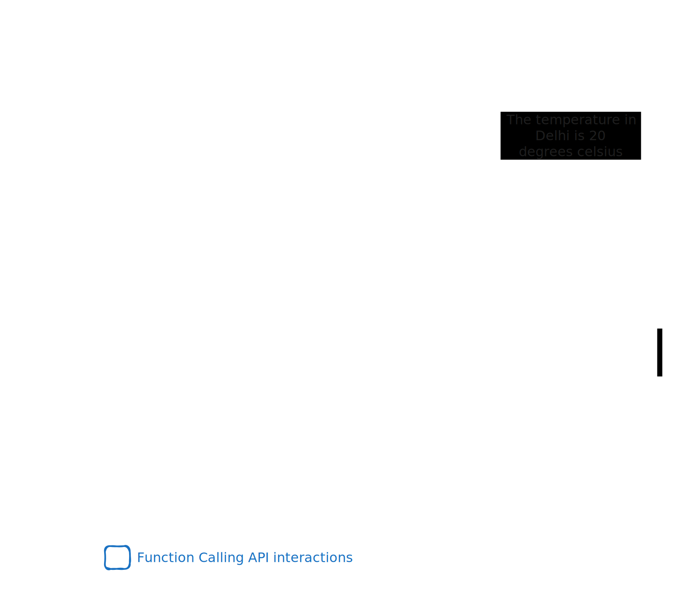

---
layout:
  title:
    visible: true
  description:
    visible: false
  tableOfContents:
    visible: true
  outline:
    visible: true
  pagination:
    visible: true
---

# Function Calling API for structured interactions

This cookbook will guide you through the process of using Anyscale's Mistral models' function calling API to interface with external tools and APIs via Portkey.

The usual procedure of leveraging function calling API:

1. Your app can utilize an LLM chat completions call with an optional `tools` property, encompassing specifications and labeled _functions_. The response from LLMs aligns with the defined specification, serving as ideal arguments for methods and functions within the application logic.
2. This allows for your app to extract of entities from text, the creation of structured outputs, to integrate with other systems and tools, such as retrieving data from databases or APIs, and interacting with external tools and APIs.
3. Integrate the data with an LLM chat completions call to produce a natural language output for the user or proceed with additional steps in your process.

For example, when building a weather app, you can use JSON web requests to obtain real-time temperature information from a third-party web API. Once powered by LLM, the app can understand and respond to user queries in plain English, while the Function Calling API can streamline interactions with the third-party web API service.



## Generate function arguments

To generate function arguments, we call chat completions and define _function_ parameters and descriptions with `tools` argument to Anyscale's `mistralai/Mixtral-8x7B-Instruct-v0.1` model.

1. **Import Portkey Client SDK**



```javascript
import Portkey from "portkey-ai";

const portkey = new Portkey({
  apiKey: process.env.PORTKEY_API_KEY,
  virtualKey: process.env.ANYSCALE_VIRTUAL_KEY,
});

```



```python
from portkey_ai import Portkey

portkey = Portkey(
    api_key="xxxx",
    virtual_key="anyscale-xxxx"
)
```



2. **Declare `messages` and `tools`**



<pre class="language-javascript"><code class="lang-javascript">// Define the messages
let messages = [
    {"role": "system", "content": "You are helpful assistant."},
    {"role": "user", "content": "What's the weather like in Delhi"}
];

// Define the tools
let tools = [
    {
        "type": "function",
        "function": {
            "name": "get_current_weather",
            "description": "Get the current weather in a given location",
            "parameters": {
                "type": "object",
                "properties": {
<strong>                    "location": {
</strong><strong>                        "type": "string",
</strong><strong>                        "description": "The city and state",
</strong>                    },
<strong>                    "unit": {"type": "string", "enum": ["celsius", "fahrenheit"]},
</strong>                },
<strong>                "required": ["location"],
</strong>            },
        },
    }
];
</code></pre>



<pre class="language-python"><code class="lang-python"><strong># Define the messages
</strong>messages = [
    {"role": "system", "content": "You are helpful assistant."},
    {"role": "user", "content": "What's the weather like in Delhi"}
]
# Define the tools
tools = [
    {
        "type": "function",
        "function": {
            "name": "get_current_weather",
            "description": "Get the current weather in a given location",
            "parameters": {
                "type": "object",
                "properties": {
                    "location": {
                        "type": "string",
                        "description": "The city and state",
                    },
                    "unit": {"type": "string", "enum": ["celsius", "fahrenheit"]},
                },
                "required": ["location"],
            },
        },
    }
]

</code></pre>



You can notice the the a specification of expected argument. In this case, we rely on a external web service APIs to give us real time temperature information, only if the API request is structured as it expects — `{"location": "City Name, Country", "format": "scale"}`

3. **Initiate chat completions with function calls activated**



```javascript
let response = await portkey.chat.completions.create({
  model: "mistralai/Mixtral-8x7B-Instruct-v0.1",
  tools,
  messages,
  tool_choice: "auto", // auto is default, yet explicit
});

console.log(response.choices[0].message)
console.log(response.choices[0].finish_reason) // tool_calls
```



```python
response = portkey.chat.completions.create(
    model="mistralai/Mixtral-8x7B-Instruct-v0.1",
    messages=messages,
    tools=tools,
    tool_choice="auto",  # auto is default, yet explicit
)
print(response.choices[0].message)
```



We will see the following response

<pre class="language-json" data-overflow="wrap"><code class="lang-json">{
    "role": "assistant",
    "content": null,
    "tool_calls": [
        "id": "call_x8we3xx", 
        "type": "function", 
        "function": {
            "name": "get_current_weather", 
<strong>            "arguments": '{\n  "location": "San Fransisco, USA",\n  "format": "celsius"\n}'
</strong>        }
    ],
}
</code></pre>

The response tells us that `get_current_weather` function specified in the `tool` is activated and the `arguments` adhere to the specification we provided. Note that the if the _temperature_ is non-zero, the output will be non-deterministic.

You can force the LLM's choice of tools by changing the `tool_choice` value

<table><thead><tr><th width="390">tool_choice</th><th></th></tr></thead><tbody><tr><td><code>auto</code></td><td>LLM automatically chooses relevant tool</td></tr><tr><td><code>none</code></td><td>LLM does not use any tool</td></tr><tr><td><p>Specify<br><br><code>{</code></p><p><code>"type": "function",</code></p><p><code>"function":</code></p><p><code>{"name":"get_current_weather"}</code></p><p><code>}</code></p></td><td>LLM chooses the selected function from the list of tools</td></tr></tbody></table>

The `finish_reason` is `tool_calls` if an chat completions call used tools.

## Use function arguments for interactions

The interactions involve making an API call to an external weather service for real-time weather data, which is then used to guide LLM responses to the user in natural language.

1. **Call to external weather service**




```javascript
/**
* getWeather(..) is a utility to call external 
* weather service APIs responds {"temperature": 20, "unit": "celsius"}
**/

let weatherData = await getWeather(JSON.parse(arguments));
let content = JSON.stringify(weatherData);

// Push assistant and tool message from earlier generated function arguments
messages.push(assistantMessage); //
messages.push({
    role: "tool", 
    content: content, 
    toolCallId: toolId, // call_x8we3xx
    name: toolName // get_current_weather
});
```





```python
import json

"""
get_weather(..) is a utility to call external weather service APIs responds {"temperature": 20, "unit": "celsius"}
"""

weather_data = get_weather(**json.loads(arguments))
content = str(weather_data)

# Append assistant and tool message from earlier generated function arguments 
messages.append(assistant_message)
messages.append({
    "role": "tool", 
    "content": content, 
    "tool_call_id": tool_id, # call_x8we3xx
    "name": tool_name # get_current_weather
})

```




2. **A chat completions call with real-time data**



```javascript
# Send the messages back to the LLM
let response = await portkey.chat.completions.create({
  model: "mistralai/Mixtral-8x7B-Instruct-v0.1",
  tools,
  messages,
  tool_choice: "auto", // auto is default, yet explicit
});

console.log(response.choices[0].message)
```



```python
# Send the messages back to the LLM
response = portkey.chat.completions.create(
    model="mistralai/Mixtral-8x7B-Instruct-v0.1",
    messages=messages,
    tools=tools,
    tool_choice="auto",
)

print(response.choices[0].message)
```



Here's the response

```json
{
    "role": "assistant",
    "content": "It's 20 degrees celsius in San Francisco.",
}
```

You built an app using Function calling API and ensured accurate user responses.&#x20;

<details>

<summary>Final Code in NodeJS</summary>

<pre class="language-javascript"><code class="lang-javascript">// This code is currently not working - (waiting on <a data-footnote-ref href="#user-content-fn-1">Portkey</a> Team)
  apiKey: process.env.PORTKEY_API_KEY,
  virtualKey: process.env.ANYSCALE_VIRTUAL_KEY,
});

const tools = [
  {
    type: "function",
    function: {
      name: "get_current_weather",
      description: "Get the current weather in a given location",
      parameters: {
        type: "object",
        properties: {
          location: {
            type: "string",
            description: "The city and state, e.g. San Francisco, CA",
          },
          unit: { type: "string", enum: ["celsius", "fahrenheit"] },
        },
        required: ["location"],
      },
    },
  },
];

const messages = [];

messages.push(
  { role: "system", content: "You are helpful assistant." },
  { role: "user", content: "What's the weather like in San Francisco?" }
);

const chat_response = await portkey.chat.completions.create({
  model: "mistralai/Mixtral-8x7B-Instruct-v0.1",
  tools,
  messages,
  tool_choice: "auto",
});

console.log(JSON.stringify(chat_response, null, 2));

const assistant = chat_response.choices[0].message;
const tool_id = assistant.tool_calls[0].id;
const tool_name = assistant.tool_calls[0].function.name;

console.log(tool_id, tool_name);

const get_weather = () => {
  // make API call to weather API service
  return JSON.stringify({
    temperature: 20,
    unit: "celsius",
  });
};

messages.push(get_weather());
messages.push({
  role: "tool",
  content: JSON.stringify({
    temperature: 20,
    unit: "celsius",
  }),
  tool_call_id: tool_id,
  name: tool_name,
});

try {
  const response = await portkey.chat.completions.create({
    model: "mistralai/Mixtral-8x7B-Instruct-v0.1",
    tools,
    messages,
    tool_choice: "auto",
  });
  console.log(response);
} catch (error) {
  console.error(error);
  // errors
  /**
   * error: {"error":{"param":null,"code":null},"provider":"anyscale"}
   */
}

</code></pre>

</details>

[^1]: [https://discord.com/channels/1143393887742861333/1184373296897204335/1193835097326100480](https://discord.com/channels/1143393887742861333/1184373296897204335/1193835097326100480)
